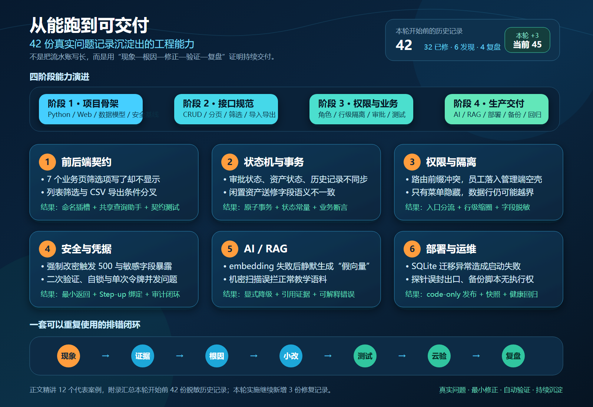
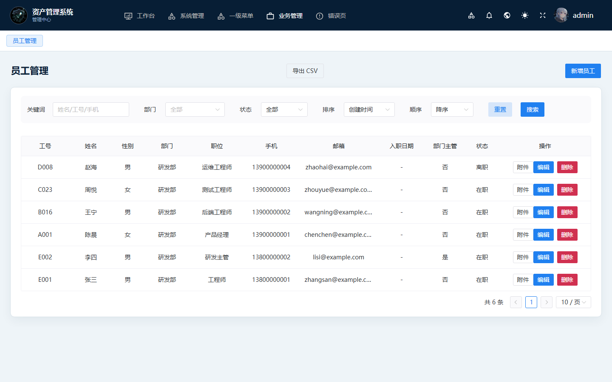

# 从能跑到可交付：项目开发历程与问题复盘

这不是一份逐日流水账，而是一份可以核验的工程过程说明：需求怎样落到功能、问题怎样被证据定位、修复怎样通过测试和部署验证，以及下一次怎样避免再犯。

## 先说明“42”是什么

- 本轮整理开始前，项目错题本中有 **42 份真实记录**：32 份专项修复、6 份问题发现、4 份阶段复盘。
- “42 份记录”不等于“恰好 42 个独立 Bug”。部分复盘包含一组同根问题，因此实际处理的问题点更多。
- 本轮在整理和补功能过程中，又新增了 3 份修复记录：业务筛选栏、测试基线污染、发布脚本帮助参数。当前内部错题本为 **45 篇**。
- 本页精讲 12 个代表案例；文末用脱敏摘要列出本轮开始前的 42 份历史记录，不公开内部日志、账号、地址或运行数据。

## 四个阶段怎样落到这个项目

| 阶段 | 培训能力主线 | 项目中的真实落点 | 可核验入口 |
|------|--------------|------------------|------------|
| 阶段 1：项目骨架 | 开发环境、编码工具、FastAPI 基础 | Python 服务、Vue 前端、SQLite 模型、统一配置、登录安全基线 | `app/`、`web/`、`run.py` |
| 阶段 2：接口规范 | 统一响应、异常处理、参数校验、数据库查询、接口调试 | CRUD、分页、筛选、Pydantic 校验、CSV 导入导出、接口契约测试 | `app/api/v1/`、`app/schemas/`、`deploy/tests/test_business_api.py` |
| 阶段 3：权限与业务 | 登录、RBAC、前后端联调、核心业务流程、AI 使用记录 | 四角色口径、行级隔离、字段脱敏、领用归还、两级审批、通知与工作台 | `app/core/dependency.py`、`app/controllers/`、`web/src/views/business/` |
| 阶段 4：综合交付 | 高阶业务、AI、测试、部署、问题排查 | 调拨、报修、盘点、附件、AI/RAG、安全中心、备份、原生部署和回归门禁 | `app/services/`、`deploy/native/`、`deploy/tests/` |

这四段不是四个互不相干的作业。后一个阶段持续暴露前一个阶段留下的边界问题：页面写出来不代表接口契约正确，接口返回 200 不代表数据隔离正确，本机能运行也不代表生产发布可靠。

## 六类真正花时间的困难

1. **前后端契约**：组件、插槽、查询参数、分页响应和导出条件必须一致。
2. **状态机与事务**：审批、资产状态、历史记录和通知要么一起成功，要么一起回滚。
3. **权限与隔离**：菜单隐藏只是表面，服务端还要重新计算角色、数据行和敏感字段。
4. **安全与凭据**：登录、改密、动态验证、单次令牌、审计与发布物都要按失败场景设计。
5. **AI / RAG**：模型调用失败必须显式降级，检索结果必须可引用，不能用“看起来能跑”的假结果掩盖故障。
6. **部署与运维**：迁移、静态资源、证书目录、探针、备份脚本和服务重启共同决定交付是否稳定。

## 12 个代表性案例

每个案例都按同一条链路描述：**业务场景 → 实际现象 → 错误方向或 AI 草稿问题 → 根因 → 人工修改 → 验证 → 防复发**。

### 1. 七个业务页写了筛选项，页面却完全看不到

- **业务场景**：员工、资产、审批、调拨、报修、领用和盘点都需要筛选。
- **实际现象**：源码中存在 `QueryBarItem`，浏览器里只有表格。
- **错误方向**：继续补后端筛选参数，或改 CSS 强行显示。
- **根因**：`CrudTable` 只渲染 `#queryBar` 命名插槽，七个页面把筛选项放进了默认插槽。
- **人工修改**：修正 7 个页面、8 个表格的插槽；员工页补齐状态、排序字段和排序方向；列表与导出共用查询助手。
- **验证**：静态契约逐页检查插槽归属；本地真实接口请求携带五类查询条件；前后截图对比。
- **防复发**：测试不只搜索“组件是否存在”，还断言“组件放在什么位置、绑定什么参数”。

| 修复前 | 修复后 |
|--------|--------|
|  |  |

### 2. 分页接口能返回数据，表格仍显示异常

- **业务场景**：通用表格需要 `page`、`page_size`、`list` 和 `total` 的稳定契约。
- **实际现象**：接口单独调试有数据，页面分页数量或第二页不正确。
- **错误方向**：在每个页面单独适配不同字段名。
- **根因**：后端分页参数和前端通用表格约定不统一，旧测试只看状态码。
- **人工修改**：统一分页输入和响应结构，把上限校验留在服务端。
- **验证**：内存 SQLite 创建 15 条以上数据，断言总数、第一页和第二页内容。
- **防复发**：列表测试必须检查内容、总数和页边界，不把“HTTP 200”当作完成。

### 3. 归还与送修都在“选资产”，业务语义却不同

- **业务场景**：归还只能选本人正在使用的资产；管理员登记送修还要支持闲置资产。
- **实际现象**：归还下拉出现错误状态的资产，或闲置资产登记送修时缺少必要的人员字段。
- **错误方向**：复用同一个“全部资产”接口，再由前端猜状态。
- **根因**：两个流程使用了相似 UI，却有不同的服务端约束和字段语义。
- **人工修改**：按流程拆查询条件；送修接口明确闲置资产的登记人规则；后端再次校验资产状态。
- **验证**：分别覆盖在用、闲置、他人资产和离职人员场景。
- **防复发**：相似页面可以复用组件，业务查询和状态校验不能只靠复用。

### 4. 审批通过不只是改一个状态数字

- **业务场景**：主管和管理员两级审批后，要同步资产、申请、历史和通知。
- **实际现象**：中途异常时，申请显示通过，资产或历史记录却没有同步。
- **错误方向**：按界面显示顺序依次写多张表，不处理失败回滚。
- **根因**：状态机跨多个模型，缺少原子事务和统一常量。
- **人工修改**：把同一次审批的写操作纳入事务；状态值集中定义；通知在状态确定后投递。
- **验证**：断言审批阶段、资产归属、历史条目和越级审批均符合预期。
- **防复发**：每个状态迁移都写“前置状态、写入集合、失败回滚、允许角色”四项。

### 5. 路由前缀碰撞让普通员工落进管理端空壳

- **业务场景**：管理员进入管理后台，员工和主管进入工作台。
- **实际现象**：普通用户登录成功后看到空白管理壳或错误首页。
- **错误方向**：给普通用户继续增加管理菜单，试图填满空壳。
- **根因**：根路由和动态路由前缀提前匹配，登录后的入口判断被覆盖。
- **人工修改**：由后端返回稳定 `portal`；路由守卫统一计算首页；管理与工作台使用不同壳和权限来源。
- **验证**：管理员、主管、员工分别断言登录落点、可见入口和越界 403。
- **防复发**：入口选择只保留一个真值函数，禁止多个重定向各自猜角色。

### 6. 菜单权限正确，数据仍可能越界

- **业务场景**：主管看本部门，员工看本人，管理员看全量。
- **实际现象**：按钮被隐藏，但直接请求列表接口可能得到多余数据或联系方式。
- **错误方向**：把前端 `v-permission` 当成完整授权。
- **根因**：菜单/API 权限、行级范围和字段级脱敏是三个不同层次。
- **人工修改**：控制器按当前用户重新计算数据范围；非本人敏感字段脱敏；看板和导出使用同一范围口径。
- **验证**：角色内容矩阵同时断言“有几行、是哪几行、哪些字段为空”。
- **防复发**：每个列表接口上线前写清角色、行范围、字段范围和导出范围。

### 7. 首次改密出现 500，同时暴露了不该返回的字段

- **业务场景**：首次登录必须修改随机初始密码。
- **实际现象**：改密流程遇到对象序列化错误，用户详情还可能带出密码哈希等内部字段。
- **错误方向**：只在前端隐藏字段，或捕获异常后返回原始堆栈。
- **根因**：更新参数、模型序列化和响应 Schema 没有形成最小返回契约。
- **人工修改**：修正更新调用；模型统一排除敏感字段；异常对外转中文通用提示、对内保留日志。
- **验证**：改密成功、旧令牌失效、用户响应无密码/密钥字段、安全头存在。
- **防复发**：敏感字段在模型层默认排除，接口只做更严格的二次收窄。

### 8. 二次验证如果不绑定操作，令牌就可能被复用

- **业务场景**：删除、导入、导出、策略修改等高风险操作需要再次验证。
- **实际现象**：早期草稿只验证“这个用户刚通过”，没有绑定具体操作和验证方式。
- **错误方向**：给所有高风险按钮共用一个长期验证码状态。
- **根因**：令牌缺少用户、操作键、验证模式、有效期和单次消费约束。
- **人工修改**：Step-up 令牌绑定五项条件并单次消费；错误操作键/模式直接失败；全程写审计。
- **验证**：专项测试覆盖错误操作、错误模式、过期和二次消费。
- **防复发**：安全令牌必须回答“谁、做什么、如何验证、何时失效、能用几次”。

### 9. embedding 失败后生成“假向量”比直接报错更危险

- **业务场景**：知识库需要向量检索，也要在模型服务暂时不可用时继续工作。
- **实际现象**：外部 embedding 失败后，旧实现静默用哈希数组冒充向量，结果看似正常但语义无效。
- **错误方向**：为了让接口永远成功而制造不可解释的替代结果。
- **根因**：把“可用性”误解成“任何返回都算成功”。
- **人工修改**：显式记录降级原因，回退到词面检索；答案附章节引用；恢复后再重建向量。
- **验证**：断网、超时和错误响应下均不写入假向量，词面检索仍能命中正确章节。
- **防复发**：AI 降级必须可观察、可解释、可恢复，禁止静默伪造成功。

### 10. 机密扫描把正常教学句也拦住了

- **业务场景**：知识库导入要拦截真实密钥，同时允许安全培训语料。
- **实际现象**：包含“API Key”“密码示例”等教学句被当成泄漏拒绝入库。
- **错误方向**：继续增加关键词黑名单。
- **根因**：只看词面，不区分占位符、上下文和真实凭据形态。
- **人工修改**：把高置信度凭据模式与普通教学词分开；保留扫描原因和可解释提示。
- **验证**：真实形态命中、示例占位符放行、边界长度和混合文本均有测试。
- **防复发**：安全扫描优先使用结构和熵特征，关键词只能作为弱信号。

### 11. 本机迁移没问题，上线却因 SQLite 能力边界启动失败

- **业务场景**：发布新字段和前端构建，同时保留生产业务库。
- **实际现象**：迁移工具尝试修改 SQLite 列注释导致服务启动失败；另一次静态目录清理碰到证书校验文件，首页返回 403。
- **错误方向**：把开发数据库迁移和静态目录替换原样搬到生产。
- **根因**：数据库方言能力、证书目录和部署脚本的文件边界没有被单独建模。
- **人工修改**：对 SQLite 不支持的注释变更显式跳过；code-only 发布只替换代码与构建；证书目录从清理范围剥离。
- **验证**：发布前快照、服务状态、首页、静态资源和回滚文件逐项点验。
- **防复发**：发布脚本必须写清“替换什么、保留什么、失败停在哪里、怎样回滚”。

### 12. 自动探针、黑名单和备份脚本也会互相伤害

- **业务场景**：发布后自动探测接口、网关限流，夜间自动备份。
- **实际现象**：探针把共享出口加入黑名单，后续验收被自己拦住；备份脚本因执行权限不足没有按时运行。
- **错误方向**：反复重试探针或只看计划任务是否存在。
- **根因**：自动化只设计了成功路径，没有验证身份/IP 语义、脚本权限和实际产物。
- **人工修改**：已登录请求不按匿名 IP 连坐；登录成功只清自动封禁；文档网段不入库；备份任务显式用 shell 执行并检查产物。
- **验证**：连续探测不自锁，服务保持 active，备份文件可打开并执行完整性检查。
- **防复发**：自动化验收既看命令退出码，也看副作用、产物和下一次能否重复运行。

## 工具 / AI 与人工判断的边界

项目允许工具或 AI 生成骨架、测试草稿、文档初稿和重复代码，但最终交付不以“生成完成”为准。人工需要负责：

1. 判断业务角色、状态机和数据边界；
2. 用日志、请求、数据库状态和截图验证现象；
3. 删除错误的通用答案，保留项目当前真值；
4. 为修复增加正向、负向和重复运行测试；
5. 检查发布包、运行服务、备份和回滚证据；
6. 把问题写成下一次可以复用的规则。

## 本轮实际验证

| 门禁 | 结果 |
|------|------|
| 内部 Python 全量 | 150 项通过 |
| 公开树 Python 全量 | 145 项通过，2 项因公开环境缺可选依赖跳过 |
| Node UI / 安全契约 | 60 项通过 |
| Vite 生产构建 | 2,825 个模块完成转换 |
| 业务筛选截图 | 本地虚构数据，真实 Vue 页面与 FastAPI 接口；请求携带状态与排序参数 |
| 云端发布 | code-only；发布前快照；服务、首页、滑块和静态资源均已点验；未以本地库覆盖生产库 |

## 本轮开始前 42 份历史记录的脱敏索引

> 下面按发生顺序摘要展示。状态统计固定为 32 个“已修”、6 个“发现”、4 个“复盘”。

| # | 状态 | 类别 | 现象摘要 | 处理 / 结论 |
|---:|------|------|----------|-------------|
| 01 | 复盘 | 安全基线 | 第一阶段只验证能启动，安全边界不足 | 建立登录、输入、配置和测试基线 |
| 02 | 复盘 | 综合修复 | 网关、状态机、前端和部署出现一组同根问题 | 按层拆分，建立回归清单 |
| 03 | 发现 | 登录风控 | 图像滑块仍存在机器识别与换出口残余风险 | 记录已接受边界，保留分层防护 |
| 04 | 发现 | 权限隔离 | 通知受众、读模型和字段范围定义不完整 | 建立隔离修复清单 |
| 05 | 发现 | 信息暴露 | 演示信息、接口定义和调试文案可能进入发布物 | 启动发布前信息检查 |
| 06 | 已修 | 通知受众 | 消息投递没有按流程阶段区分接收者 | 统一通知类型与阶段投递 |
| 07 | 已修 | 数据隔离 | 主管/员工列表与看板范围过宽 | 行级缩圈与字段脱敏 |
| 08 | 已修 | 身份模型 | 账号角色与员工主管身份存在双轨 | 统一业务角色解析并做矩阵测试 |
| 09 | 已修 | 入口体验 | 管理后台与工作台缺少稳定分流 | 独立入口壳与中文 403 |
| 10 | 已修 | 敏感响应 | 强制改密异常、哈希字段与安全头缺口 | 最小响应、统一排除和安全头 |
| 11 | 已修 | 菜单权限 | 普通用户看到过多管理入口 | 收窄菜单并补工作台看板 |
| 12 | 已修 | 信息暴露 | Schema、文档、JWT 和匿名文案泄漏实现细节 | 分级清理与发布检查 |
| 13 | 已修 | 登录风控 | 登录缺少强制滑块与失败锁定 | 滑块、频率限制和失败计数 |
| 14 | 复盘 | 执行排错 | 命令差异、错误方法和令牌时效造成误判 | 固化可重复命令与证据顺序 |
| 15 | 复盘 | 历史归档 | 已修问题散落在交接和测试报告 | 归并为可检索错题本 |
| 16 | 已修 | 会话安全 | 访问令牌有效期过长 | 缩短默认时长并验证旧会话 |
| 17 | 已修 | 安全运营 | 登录日志、封禁、动态验证和审计缺统一入口 | 建立零成本安全运营包 |
| 18 | 已修 | 登录视觉 | 登录页缺少完成度和状态反馈 | 重做深海视觉与交互反馈 |
| 19 | 发现 | 路由 | 全员登录可能落入管理端空壳 | 锁定前缀冲突与入口真值 |
| 20 | 已修 | 路由 | 工作台落点被根路由提前重定向 | 统一 portal 与守卫逻辑 |
| 21 | 已修 | 报修 | 闲置资产登记送修缺人员语义 | 补字段契约与状态校验 |
| 22 | 已修 | 加载体验 | Logo、动画和文字没有同轴 | 统一加载布局和响应尺寸 |
| 23 | 发现 | 凭据 | 历史包和脚本可能残留旧凭据 | 列出轮换与发布物清理范围 |
| 24 | 发现 | 安全检索 | 安全中心筛选前后端参数断层 | 明确组合筛选契约 |
| 25 | 已修 | AI 前端 | 助手抽屉发送时会话变量未定义 | 修正状态来源并加契约测试 |
| 26 | 已修 | 敏感字段 | 用户列表返回了模型服务配置 | Schema 最小化与敏感字段排除 |
| 27 | 已修 | AI 路由 | 助手路由元信息缺失导致启动异常 | 补齐路由契约和启动测试 |
| 28 | 已修 | 发布门禁 | 发布包内曾出现不应进入仓库的凭据材料 | 轮换、历史清理与密钥扫描 |
| 29 | 已修 | 数据库 | 通知表索引初始化不完整 | 补结构修复和重复执行校验 |
| 30 | 已修 | 安全检索 | 成功状态、时间和地区排除不能组合 | 统一 FilterSpec 与下钻 |
| 31 | 已修 | 滑块交互 | 错误位置曾出现“假绿色”反馈 | 以服务端结果驱动状态样式 |
| 32 | 已修 | 二次验证 | 高风险操作验证、自锁和恢复流程不完整 | 操作绑定、单次令牌和审计 |
| 33 | 已修 | 静态发布 | 证书校验文件阻塞静态目录替换，首页 403 | 隔离证书目录并验证回滚 |
| 34 | 已修 | 知识库 | 正常教学句被机密扫描误拦 | 区分真实凭据形态与占位语料 |
| 35 | 已修 | 数据迁移 | SQLite 不支持的列注释迁移造成启动失败 | 方言能力判断与显式跳过 |
| 36 | 已修 | 开源脚本 | 演示口令曾有不恰当回退策略 | 强制环境变量并禁止回显 |
| 37 | 已修 | 登录二步 | 下载说明块挤掉验证按钮 | 调整信息层级和响应布局 |
| 38 | 已修 | 备份 | 定时备份脚本缺执行权限 | 显式 shell、权限和产物校验 |
| 39 | 已修 | 网关 | 发布探针误封共享出口并影响本人验收 | 匿名/登录分桶与自动解封边界 |
| 40 | 已修 | AI / RAG | embedding 失败后静默生成假向量 | 显式降级到词面检索 |
| 41 | 已修 | AI 异常 | 对话失败把异常类型回给浏览器 | 中文通用提示与内部日志分离 |
| 42 | 已修 | 公开门禁 | 公开树缺件、测试契约和依赖锁漂移 | 补公开回归与依赖门禁 |

## 建议演示顺序

1. 先看 README 的产品定位和六层架构；
2. 打开员工管理，展示新增的关键词、部门、状态和安全排序；
3. 对照修复前后截图，解释命名插槽根因；
4. 展示两级审批或调拨/报修中的一个完整业务闭环；
5. 展示角色之间的菜单、数据行和字段差异；
6. 展示知识库引用和明确降级，而不是只演示“AI 会聊天”；
7. 最后用踩坑地图、测试结果和这份 42 条索引说明工程过程。

## 一句话总结

项目的价值不只在于“功能数量”，而在于：遇到问题后能留下证据、找到机制根因、做最小修正、自动回归、稳定发布，并把结论沉淀为下一次可复用的规则。
