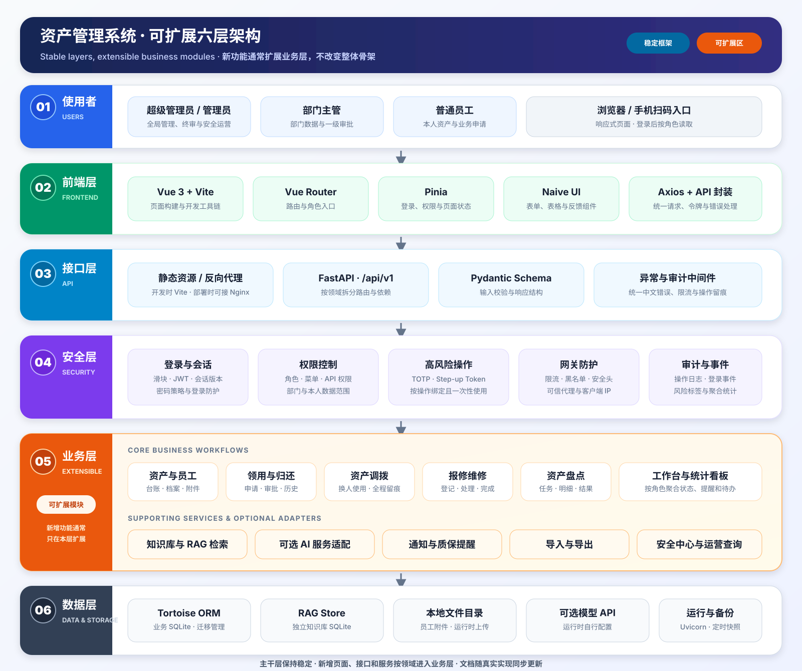
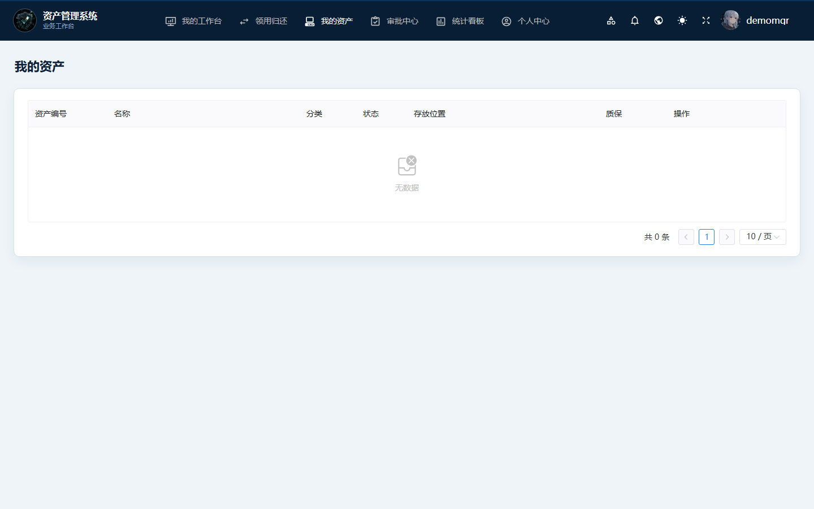
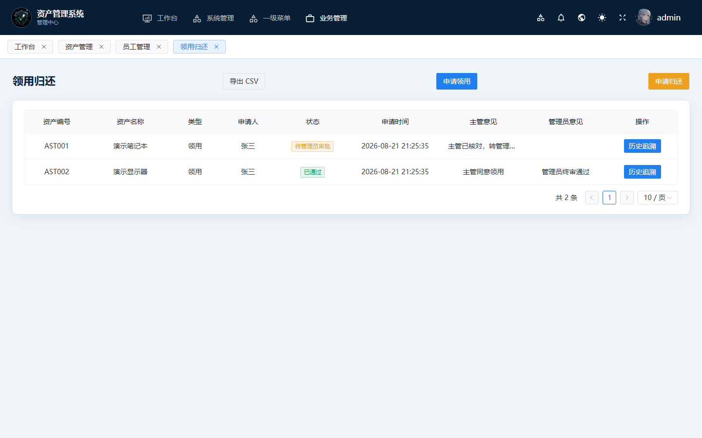
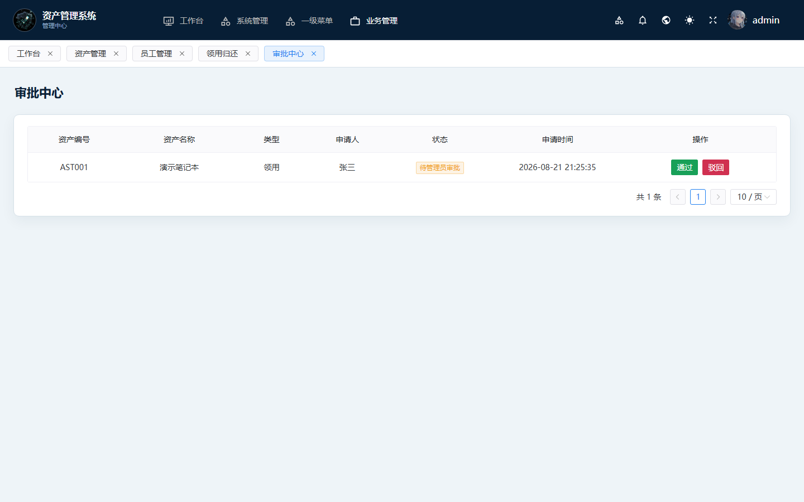
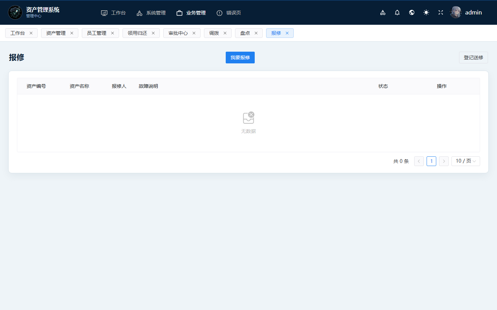
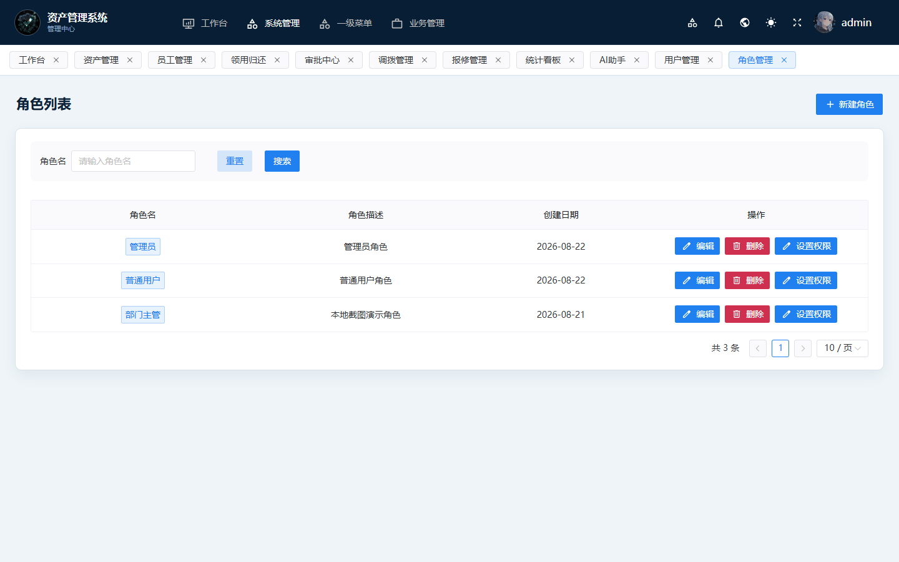

<p align="center">
  
</p>

<h1 align="center">资产管理系统</h1>

<p align="center">
  把散落在表格、聊天记录和纸质单据里的资产信息，整理成一套每个人都知道下一步该做什么的工作台。
</p>

<p align="center">
  
  
  
  
  
</p>

<p align="center">
  <a href="./README-en.md">English</a>
  ·
  <a href="./README-部署与使用教程.md">部署与使用教程</a>
  ·
  <a href="./SECURITY.md">安全说明</a>
  ·
  <a href="./LICENSE">MIT License</a>
</p>

---

## 这套系统解决什么问题？

它面向需要管理电脑、显示器、办公设备等内部资产的小型团队和企业：

- **行政 / 资产管理员**不再反复核对多份表格，可以统一登记资产、员工、位置、价格和质保时间。
- **员工**能看到自己名下的设备，直接提交领用、归还、调拨或报修申请。
- **部门主管**只处理本部门的待办，管理员完成最终审批，过程和结果都有记录。
- **管理者**从工作台和统计看板掌握在用、闲置、维修、临期质保及流程待办情况。

系统覆盖从资产入库到领用、归还、调拨、报修、盘点的日常闭环，同时提供知识库、可选 AI 助手、安全中心和手机扫码入口。

## 系统架构：稳定六层，业务模块可扩展

<p align="center">
  
</p>

这张图描述的是当前代码的真实边界，而不是限制以后只能做这些功能：

- **第 1～4 层是稳定主干。** 用户入口、Vue 前端、FastAPI 接口和权限安全共同形成通用框架。
- **第 5 层是主要扩展区。** 新的资产业务通常按“页面 + API + Schema + Service/Controller + Model + Test”进入这一层。
- **第 6 层隔离数据与外部能力。** 业务数据、知识库、附件和可选模型服务各有明确入口，不把第三方配置写进业务页面。
- 架构图本身只用于说明项目，不参与编译和运行；以后增加功能时，按真实实现补充模块名称即可。

### 一次业务请求怎样走完？

以员工提交资产调拨为例，请求会依次经过：

1. **页面交互：** `web/src/views/business/` 收集表单，前端 API 封装通过 Axios 发出请求。
2. **路由与校验：** `app/api/v1/` 匹配领域路由，Pydantic Schema 校验输入字段和格式。
3. **身份与范围：** 依赖和中间件验证登录会话、角色/API 权限、部门或本人数据范围；高风险操作按策略增加 TOTP 或 Step-up Token。
4. **业务规则：** Controller / Service 判断资产状态、申请人范围和流程条件，再调用数据模型完成变更。
5. **持久化与留痕：** Tortoise ORM 写入业务 SQLite；审计日志、通知或安全事件按对应规则记录。
6. **统一响应：** FastAPI 返回结构化结果，前端刷新列表并用中文消息提示成功或具体错误。

前端隐藏按钮只是第一层体验控制，真正的数据范围和操作权限仍由后端再次判断。

### 技术栈与职责

| 层次 | 当前技术 | 在项目中负责什么 |
| --- | --- | --- |
| 页面与交互 | Vue 3、Vite、Naive UI、Vue Router、Pinia | 页面、导航、角色入口、表单表格和前端状态 |
| HTTP 通信 | Axios、统一 API 封装 | 附带登录令牌、发送请求、处理统一响应与错误 |
| Web API | FastAPI、Pydantic | 路由、依赖注入、输入校验和响应结构 |
| 权限与安全 | JWT、RBAC、数据范围、TOTP、Step-up、中间件 | 登录、角色/API 权限、部门隔离、高风险操作验证、限流和审计 |
| 业务实现 | Controller、Service、Tortoise Model | 资产流程、审批规则、统计、通知、知识库及安全运营 |
| 数据与迁移 | SQLite、Tortoise ORM、Aerich、独立 RAG Store | 业务数据、迁移、知识库文档与检索索引 |
| 运行与部署 | Uvicorn、可选 Nginx、Docker / 原生模板 | 启动 API、托管前端、反向代理、备份与部署参考 |

### 当前模块边界

| 模块组 | 当前包含 | 代码入口 |
| --- | --- | --- |
| 组织与权限 | 用户、角色、菜单、API、部门、员工与账号绑定 | `app/models/admin.py`、`app/api/v1/users/`、`roles/`、`depts/`、`employees/` |
| 资产主数据 | 资产台账、状态、分类、位置、质保和二维码 | `app/models/business.py`、`app/api/v1/assets/`、`web/src/views/business/asset/` |
| 资产流程 | 领用归还、审批、调拨、报修和盘点 | `app/api/v1/asset_uses/`、`asset_transfers/`、`asset_repairs/`、`inventorys/` |
| 运营辅助 | 工作台、统计看板、通知、质保提醒、导入导出 | `app/services/dashboard_service.py`、`notification_service.py`、`warranty.py`、`export_service.py` |
| 知识与 AI | 本地知识库、词面/RAG 检索、引用回答、可选模型适配 | `app/services/rag_service.py`、`rag_store.py`、`ai_service.py`、`app/api/v1/ai/` |
| 安全运营 | 登录事件、风险聚合、查询筛选、验证策略和审计 | `app/api/v1/security/`、`app/services/security_agg.py`、`security_query.py` |

### 数据保存在哪里？

- `db/db.sqlite3`：运行时业务数据库，由 Tortoise ORM 访问；数据库文件不进入 Git。
- `db/rag.sqlite3`：知识库文档和检索分块的独立存储；同样属于运行时文件。
- 员工附件和上传内容：保存在运行时目录，通过登录与权限校验后的接口读取。
- 模型服务：属于可选外部能力，只在运行时填写自己的服务地址、模型和密钥，仓库不预置凭据。
- `migrations/` 与 `deploy/native/backup_sqlite_daily.sh`：分别负责结构迁移记录和本地数据库快照参考。

## 这个项目是怎样做出来的

项目不是一次生成后就结束，而是沿着四个阶段持续收口：先搭出 Python / Web 骨架，再统一接口、分页与校验，然后补齐权限隔离和核心业务，最后把 AI、测试、部署、备份和复盘接成可交付闭环。

本轮整理开始前，项目沉淀了 **42 份真实问题、修复与复盘记录**：**32 份专项修复、6 份问题发现、4 份阶段复盘**。部分复盘包含多个缺陷，因此这里描述的是“记录数”，不是虚构成恰好 42 个独立 Bug。本轮边整理边实现，又新增了业务筛选栏、测试基线和发布脚本 3 份修复记录，当前内部错题本为 45 篇。


最有代表性的六类困难是：前后端契约、状态机与事务、权限与隔离、安全与凭据、AI/RAG、部署与运维。正文没有把 42 篇原文全部塞进首页，而是精讲 12 个能体现判断过程的案例，并提供 42 条脱敏索引：

- 为什么 7 个业务页明明写了筛选项，浏览器却完全看不到；
- 为什么菜单权限正确仍不等于数据行和敏感字段安全；
- 为什么 embedding 失败后生成“假向量”比直接报错更危险；
- 为什么迁移、证书目录、探针和备份脚本都会影响最终交付。

### 代表性修复：员工筛选与导出条件一致

| 修复前：筛选组件落在错误插槽 | 修复后：五类条件可见并进入真实请求 |
|--------------------------------|--------------------------------------|
|  |  |

修复采用测试先行：先让契约测试证明 7 个页面缺少 `#queryBar`，再做最小修改；员工列表与 CSV 导出现在共用关键词、部门、状态、排序字段和排序方向，服务端排序只接受固定白名单。公开树回归结果为 **Python 145 项通过（2 项可选依赖跳过）、Node 契约 60 项通过、Vite 2,825 个模块完成转换**。

完整的四阶段对照、12 个代表案例、AI/人工边界、测试证据和 42 条脱敏历史索引见 [`PROJECT-JOURNEY.md`](./PROJECT-JOURNEY.md)。

## 第一次打开后，建议这样使用

1. 管理员先建立部门和员工档案，并为员工绑定登录账号。
2. 在“资产管理”登记资产编号、分类、状态、位置、价格和质保到期日。
3. 员工从业务工作台提交领用、归还、调拨或报修申请。
4. 部门主管处理本部门初审，管理员在审批中心完成终审。
5. 定期发起盘点，在统计看板和安全中心检查运营与登录情况。

## 主要功能截图与操作说明

以下截图全部来自 `127.0.0.1` 本地演示环境，仅使用虚构姓名、`example.com` 和演示资产编号，不包含线上数据。

### 1. 登录：每次先完成滑块校验

<p align="center">
  
</p>

- **谁在用：** 所有用户。
- **这一步做什么：** 滑块完成后再提交账号信息；管理员还可按策略使用动态验证器。
- **点哪里：** 拖动滑块到目标位置，填写账号信息，然后点击“登录”。

### 2. 管理端工作台：先看全局，再进具体模块

<p align="center">
  
</p>

- **谁在用：** 管理员。
- **这一步做什么：** 查看资产总数、在用、闲置、维修、报废和临期质保，并快速进入高频功能。
- **点哪里：** 从右侧“快捷操作”进入资产、员工、审批或统计页面；下方可继续查看资产状态趋势。

### 3. 员工 / 主管工作台：只展示和自己岗位有关的事

<p align="center">
  
</p>

- **谁在用：** 普通员工和部门主管。
- **这一步做什么：** 员工处理自己的资产与申请；主管同时看到本部门待办和审批入口。
- **点哪里：** 从“快速入口”打开领用归还、我的资产、调拨、报修、盘点或审批中心。

### 4. 资产台账：一台设备一条记录

<p align="center">
  
</p>

- **谁在用：** 管理员和有查看权限的岗位。
- **这一步做什么：** 统一维护资产编号、名称、分类、型号、序列号、价格、状态、位置和领用人。
- **点哪里：** 点击右上角“新增资产”登记单台设备；已有数据可使用 CSV 导入或导出。

### 5. 员工档案：把人员、部门和登录账号关联起来

<p align="center">
  
</p>

- **谁在用：** 管理员。
- **这一步做什么：** 管理工号、姓名、部门、岗位、联系方式、主管标记和在职状态。
- **点哪里：** 点击“新增员工”建档；需要登录系统时，再为员工绑定对应账号。

### 6. 我的资产：员工只看自己名下的设备

<p align="center">
  
</p>

- **谁在用：** 员工和部门主管。
- **这一步做什么：** 查看自己正在使用或维修中的设备，不必在全公司资产里查找。
- **点哪里：** 在符合状态时，可直接从右侧操作区发起报修或调拨。

### 7. 领用与归还：申请、审批、结果都留痕

<p align="center">
  
</p>

- **谁在用：** 员工发起，主管和管理员审批。
- **这一步做什么：** 记录资产、申请人、类型、状态、申请时间和审批意见。
- **点哪里：** 员工点击“申请领用”或“申请归还”；管理员可从该页查看历史记录。

### 8. 审批中心：把待办集中到一个地方

<p align="center">
  
</p>

- **谁在用：** 部门主管和管理员。
- **这一步做什么：** 主管先核对本部门申请，管理员完成终审；驳回时保留原因。
- **点哪里：** 对待处理记录点击“通过”或“驳回”，处理后状态会回写到申请与资产台账。

### 9. 资产调拨：设备换人使用，历史不丢

<p align="center">
  
</p>

- **谁在用：** 当前领用人发起，主管和管理员审批。
- **这一步做什么：** 记录调出人、调入人、调拨原因和审批状态；通过后资产仍保持“在用”。
- **点哪里：** 点击“申请调拨”选择在用资产和调入员工，审批人再点击“通过”或“驳回”。

### 10. 报修：从故障说明到修好登记

<p align="center">
  
</p>

- **谁在用：** 员工、主管和管理员。
- **这一步做什么：** 记录故障、报修人和维修状态，避免报修信息散落在聊天记录里。
- **点哪里：** 员工点击“我要报修”；管理员也可“登记送修”，维修结束后点击“修好”登记去向。

### 11. 盘点：逐台标记相符、盘亏或不符

<p align="center">
  
</p>

- **谁在用：** 管理员或部门主管发起，相关岗位参与核对。
- **这一步做什么：** 固化盘点时的账面快照，再逐台登记实盘结果。盘亏只记录，不会自动报废资产。
- **点哪里：** 点击“发起盘点”创建任务，进入“明细”后对每台资产选择“相符”“盘亏”或“不符”，确认后再结束盘点。

### 12. 统计看板：用图表理解资产结构

<p align="center">
  
</p>

- **谁在用：** 管理员和管理者。
- **这一步做什么：** 查看资产分类、状态、部门分布以及近期流转情况，快速发现闲置或维修设备。
- **点哪里：** 从业务管理进入“统计看板”；数据随台账和审批结果更新。

### 13. 知识库：上传自己的说明，再按资料提问

<p align="center">
  
</p>

- **谁在用：** 需要查询制度、流程和操作说明的用户。
- **这一步做什么：** 上传 UTF-8 的 `.txt` / `.md` 文档，按已入库资料回答，并显示引用片段。
- **点哪里：** 点击“上传 txt/md”入库资料；输入问题或点击示例问题，再点击“提问”。没有合格向量服务时会明确使用中文词面检索。

### 14. AI 助手：可选接入自己的模型服务

<p align="center">
  
</p>

- **谁在用：** 需要业务问答或数据分析辅助的用户。
- **这一步做什么：** 进行资产、员工、审批相关问答；模型服务为可选配置，仓库不包含任何模型密钥。
- **点哪里：** 点击“配置 API”选择服务商并填写自己的配置，保存后在输入框提问。图片理解需要单独配置视觉模型。

### 15. 安全中心：看登录、风险和验证策略

<p align="center">
  
</p>

- **谁在用：** 超级管理员。
- **这一步做什么：** 汇总登录事件、风险标签、封禁记录、验证策略和证书状态，帮助管理员判断异常情况。
- **点哪里：** 使用顶部标签切换登录日志、风险事件、封禁、二次验证和 HTTPS 信息；策略修改按配置要求再次验证。

### 16. 用户与角色：账号、岗位和权限分开维护

| 用户管理 | 角色管理 |
| --- | --- |
|  |  |

- **谁在用：** 超级管理员。
- **这一步做什么：** 用户页管理账号状态和角色绑定；角色页维护管理员、部门主管、普通用户等岗位权限。
- **点哪里：** 在用户行点击“编辑”分配角色；在角色行点击“分配权限”调整菜单和接口能力。

### 17. 手机扫码：从资产标签直接打开详情

<p align="center">
  
</p>

- **谁在用：** 现场查看设备的员工、主管或管理员。
- **这一步做什么：** 二维码按资产编号打开轻量详情页；登录后仍按岗位权限读取数据。
- **点哪里：** 用手机扫描资产二维码，查看状态和领用人；符合条件时可继续进入报修或调拨。

## 权限与安全边界

- 管理员、部门主管和普通员工看到的入口与数据范围不同，接口侧也会再次校验。
- 登录滑块、动态验证器、操作再次验证均可按策略启用。
- 首次管理员验证器设置属于安全基线；不要用 SQL 去关二次验证。
- AI 与知识库不会在仓库中预置模型密钥；运行时数据库、上传文件和本地密钥均已加入忽略规则。
- 安全中心用于辅助判断和审计，不代替 HTTPS、反向代理、主机防火墙与日常备份。

## 快速开始

环境要求：Python 3.11+、Node.js 18+。

```bash
git clone https://github.com/LanSang11/asset-admin.git
cd asset-admin

python -m venv .venv
# Windows: .venv\Scripts\activate
# Linux/macOS: source .venv/bin/activate
pip install -r requirements.txt
python run.py
```

另开一个终端启动前端：

```bash
cd web
npm install
npm run dev
```

浏览器打开 `http://127.0.0.1:3100`。空库首次启动会在后端日志中生成管理员一次性初始凭据；首次进入后按页面引导修改并完成管理员验证器设置。

如需写入纯本地演示账号和假数据，请先设置自己的演示密码，再执行：

```bash
# Windows PowerShell
$env:DEMO_PASSWORD="请设置一个本地演示密码"
python deploy/init_oss_demo_data.py --db db/db.sqlite3
```

完整的 Docker、本地运行、备份和首次登录步骤见 [`README-部署与使用教程.md`](./README-部署与使用教程.md)。

## 项目目录

```text
app/
├─ api/v1/          FastAPI 领域路由：资产、员工、流程、知识库、安全等
├─ controllers/     通用查询与管理控制器
├─ core/            应用初始化、中间件、认证、权限、异常与网关控制
├─ models/          Tortoise ORM 数据模型
├─ schemas/         Pydantic 输入输出模型
├─ services/        看板、通知、质保、RAG、AI、安全和导入导出服务
├─ settings/        环境变量与 ORM 配置
└─ utils/           网络、地理、风险、时间等通用工具

web/src/
├─ api/             与后端路由对应的请求封装
├─ views/business/  资产、员工、审批、调拨、报修、盘点等业务页面
├─ router/          路由定义与动态导航
├─ store/           Pinia 登录、权限和应用状态
├─ components/      可复用组件
└─ composables/     页面共享逻辑与操作验证封装

deploy/
├─ data/            可公开的知识库初始化语料
├─ native/          原生部署、反向代理与备份模板
├─ tests/           Python 单元测试与前端契约测试
├─ tools/           发布前检查和辅助工具
└─ sample-picture/  README 图片与架构图

migrations/         Aerich 数据库迁移
run.py              Uvicorn 启动入口
```

### 建议的代码阅读顺序

1. 从 `run.py`、`app/__init__.py` 和 `app/core/init_app.py` 看应用如何启动、挂载中间件和注册路由。
2. 从 `app/api/v1/__init__.py` 看所有 API 领域，再进入一个具体模块跟踪请求。
3. 对照 `app/models/business.py` 与 `app/schemas/` 理解数据模型和接口字段。
4. 在 `app/services/` 查看跨接口复用的业务能力，例如看板、通知、质保和知识库。
5. 对照 `web/src/api/` 与 `web/src/views/business/` 查看前端怎样调用接口并呈现流程。
6. 最后运行 `deploy/tests/`，用现有测试确认理解和扩展没有改变既定边界。

第三方组件与许可证说明见 [`NOTICE`](./NOTICE)。
