<p align="center">
  
</p>

<h1 align="center">资产管理系统</h1>

<p align="center">
  员工与资产台账后台：领用、归还、调拨、报修、盘点、审批、知识库、安全中心。
</p>

<p align="center">
  
  
  
  
  
</p>

<p align="center">
  <a href="./README-en.md">English</a>
  ·
  <a href="./README-部署与使用教程.md">部署教程</a>
  ·
  <a href="./LICENSE">MIT License</a>
</p>

## 界面预览

登录（滑块校验）：

<p align="center">
  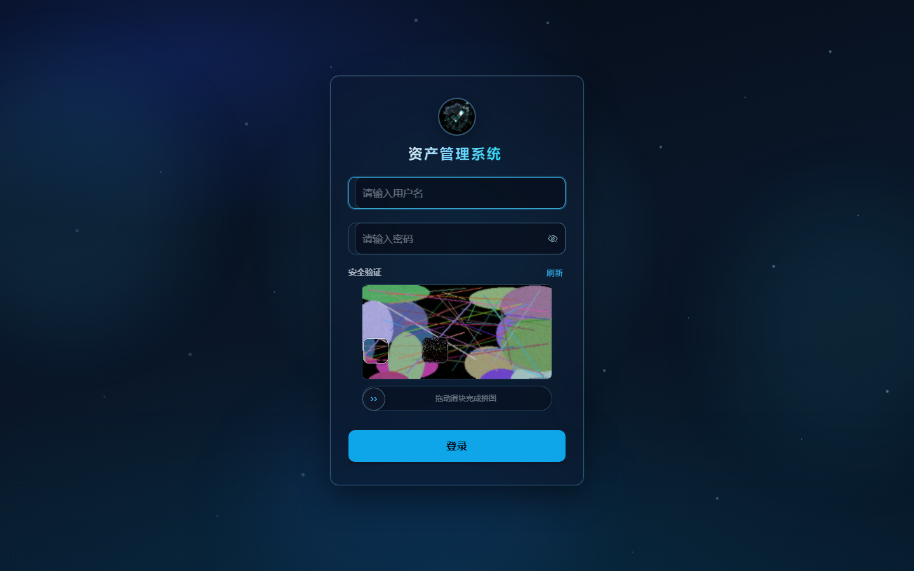
</p>

管理端工作台：

<p align="center">
  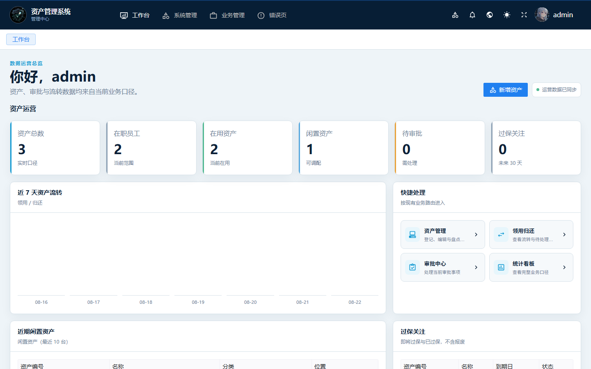
</p>

员工 / 主管工作台：

<p align="center">
  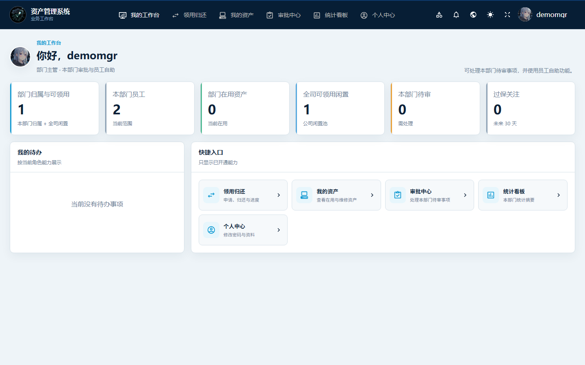
</p>

| 资产管理 | 员工管理 |
| --- | --- |
| 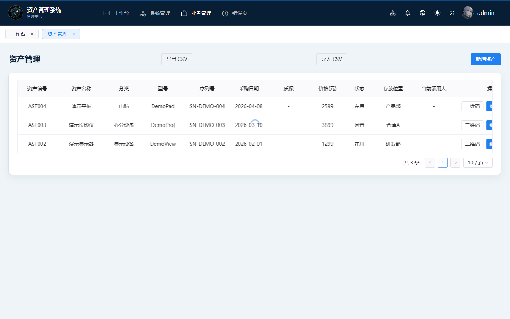 | 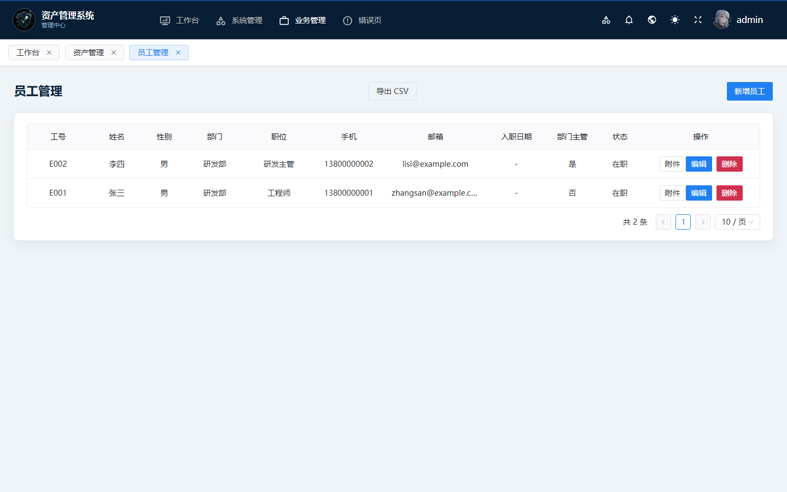 |
| 统计看板 | 知识库 |
| 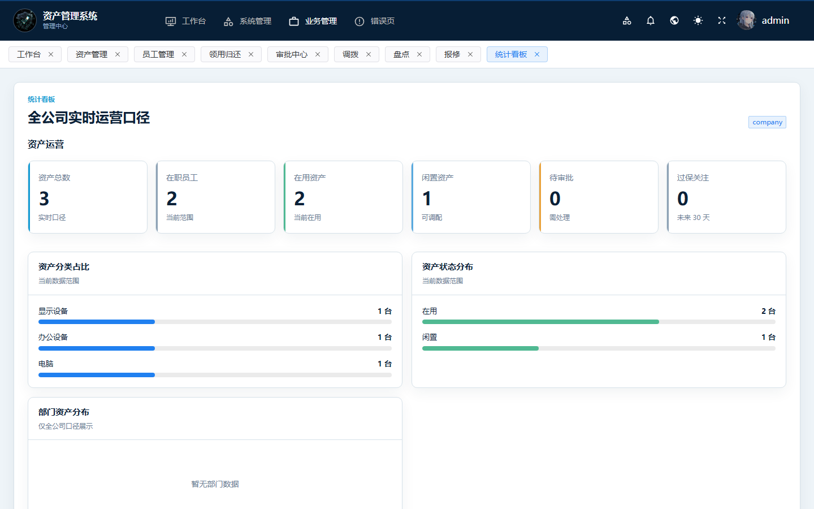 | 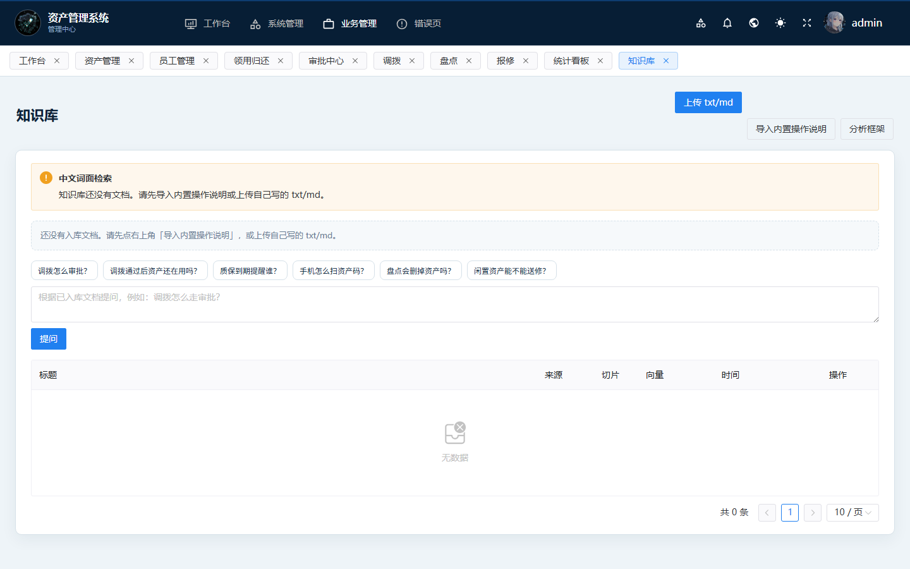 |
| 调拨 | 盘点 |
| 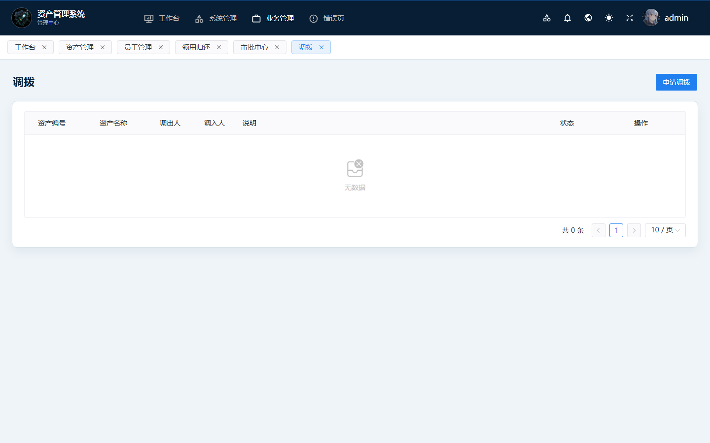 | 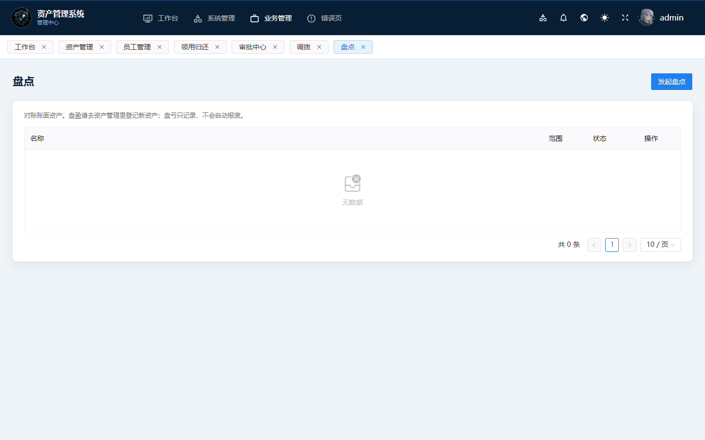 |
| AI 助手 | 安全中心 |
| 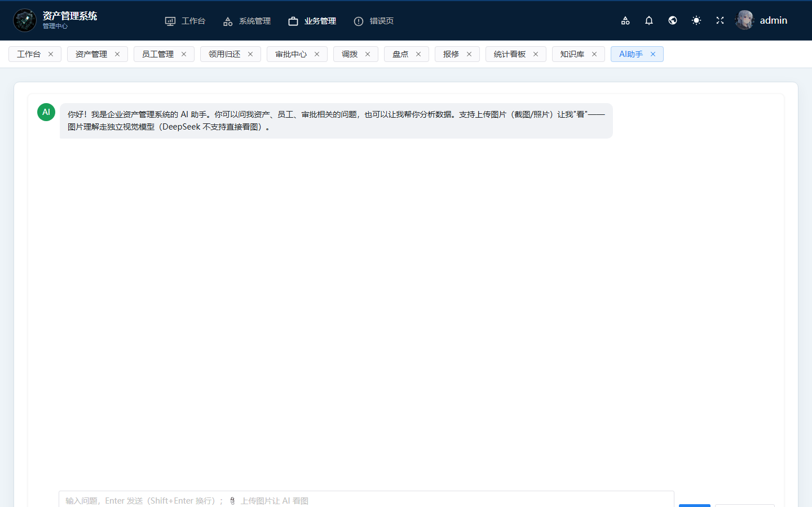 | 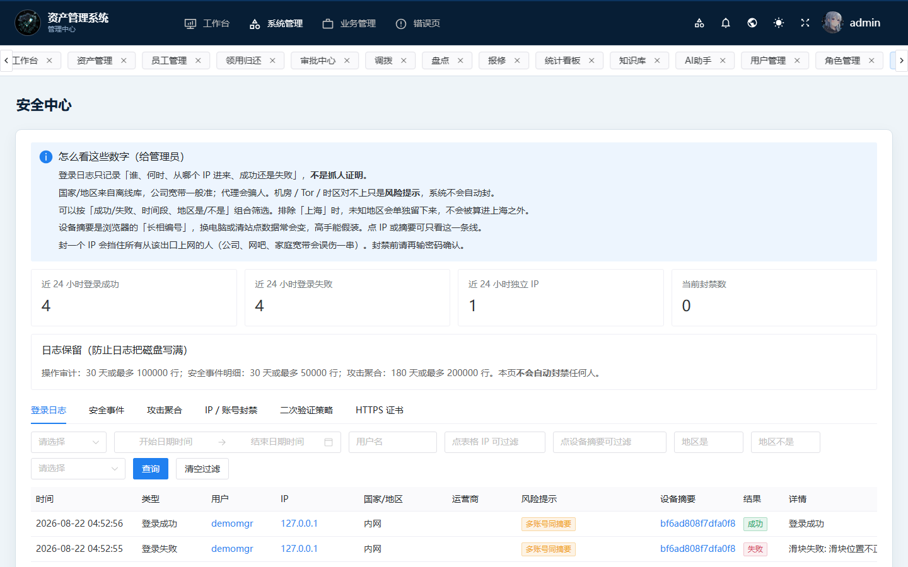 |
| 用户与角色 | 手机扫码 |
| 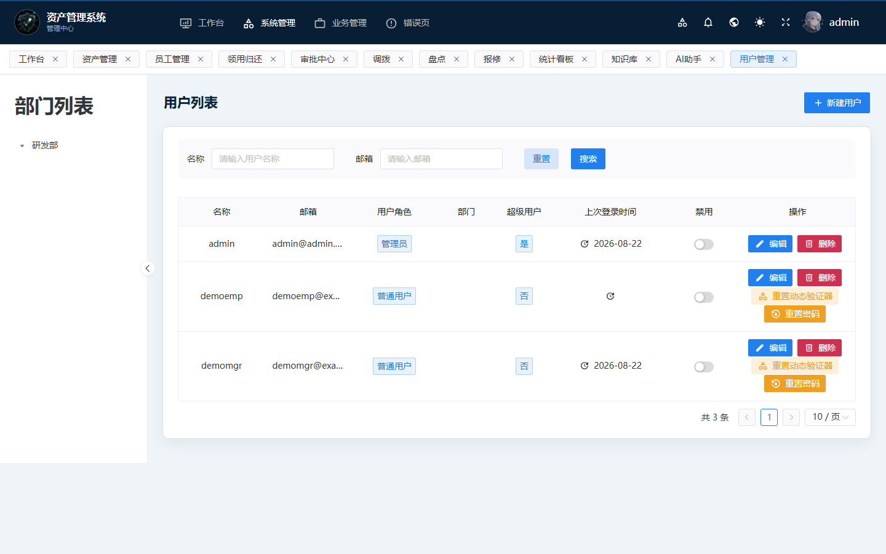 | 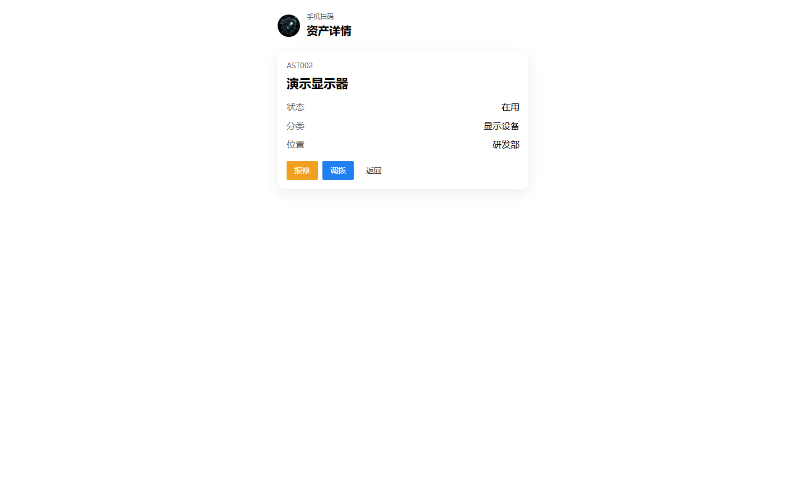 |

截图来自本地演示数据（张三 / 李四 / `example.com`），不含生产环境信息。

## 功能

- **台账**：员工、资产、分类、位置、质保到期提醒
- **流转**：领用 / 归还、调拨、报修、审批
- **盘点**：发起盘点、对账、只记录不自动报废
- **两个入口**：管理后台与员工工作台，按角色看到不同菜单
- **安全**：登录滑块、TOTP、操作二次验证、安全中心（登录日志 / 封禁 / 证书）
- **知识库与 AI**：上传说明文档后提问；AI 只读，仓库不含密钥
- **扫码**：资产二维码，手机打开详情后可报修或调拨

权限模型：超级管理员 / 部门主管 / 普通员工。按钮和接口都按角色控制。

## 快速开始

```bash
git clone https://github.com/LanSang11/asset-admin.git
cd asset-admin

python -m venv .venv
.venv\Scripts\activate
pip install -r requirements.txt
python run.py
```

另开终端构建并预览前端：

```bash
cd web
npm install
npm run dev
```

浏览器打开 http://127.0.0.1:3100 。完整步骤见 `README-部署与使用教程.md`。

本地空库可写入演示账号（张三 / 李四，`example.com`）：

```bash
set DEMO_PASSWORD=你的演示密码
python deploy/init_oss_demo_data.py --db app.db
```

不要对生产库跑，也不要把 Key 或密码写进仓库。空库第一个 `admin` 需要先绑定验证器才能进后台。

## 目录

```
app/       FastAPI 后端
web/       Vue3 前端
deploy/    部署模板、演示脚本、截图
```

第三方组件见 `NOTICE`。
